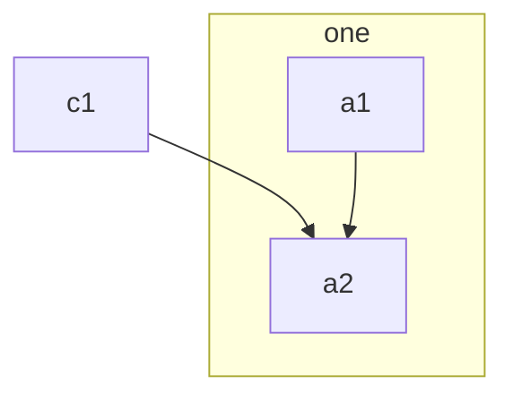
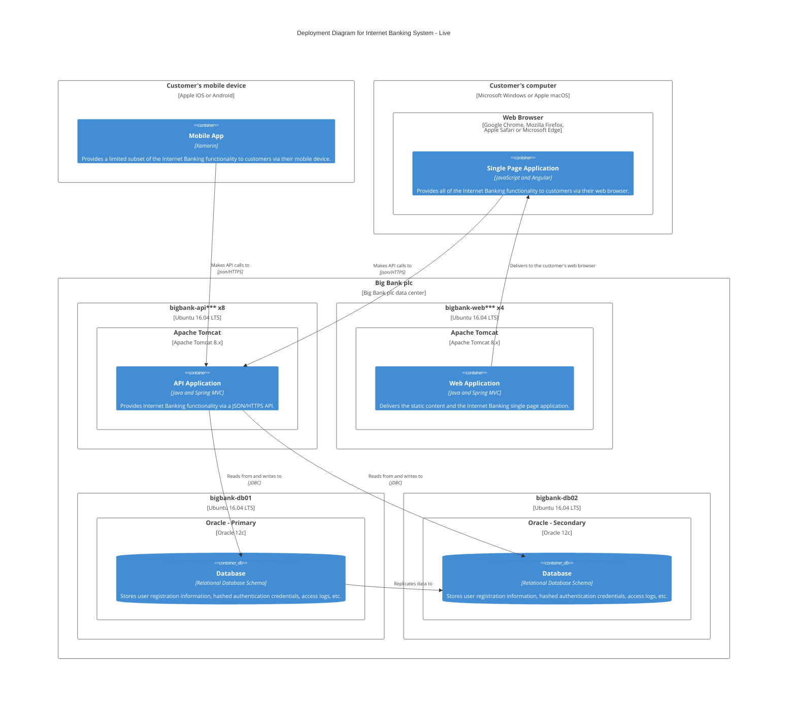

# Архитектура решения Nexo Hub

## 1. Введение

Данный документ является описанием архитектуры программной системы
Nexo Hub для управления умным домом.

## 2. Обзор

[//]: TODO: Рассказ о том, как работает система человеческим литературным
      языком. Кто инициирует взаимодействие, с кем кто общается и когда,
      какие процессы происходят без лишних подробностей.

## 3. Компоненты

### 3.1 App

#### 3.1.1 Описание

Мобильное приложение. Позволяет управлять личным кабинетом и умным домом.
Является фронтэндом системы, через который люди могут взаимодействовуют
со всей инфраструктурой.

#### 3.1.2 Технологии

1. **Kotlin** в качестве языка программирования.

2. **Android Framework** как платформа для разворачивания приложения.

3. **Jetpack Compose** для построения пользовательского интерфейса.

4. **gRPC** протокол для взаимодействия с **Gate**.

### 3.2 Gate

#### 3.2.1 Описание

Микросервис для связи с мобильными приложениями. Пользователи (мобильного
приложения) взаимодействует исключительно с данным сервисом, он является
фасадом всей микросервисвисной системы.

#### 3.2.2 Обязанности

1. Принимает и обрабатывает запросы мобильного приложения, выдает
   ответы на них.

2. Проводит аутентификацию и первичную авторизацию пользователя.

3. ...

#### 3.2.3 Технологии

1. **Kotlin** в качестве языка программирования.

2. **Ktor** как основа приложения.

3. **gRPC** протокол для взаимодействия с **App** и другими микросервисами.

4. **Yandex OAuth** для аутентификации пользователей.

5. **Redis** для кеширования данных аутентификации и слабо волатильных данных.

6. **PostgreSQL** - основная база данных.

### 3.3 Kernel

Микросервис для работы с БД. Хранит информацию о домах, привязанных устройствах,
подробные данные владельцев.

#### 3.3.1 Обязанности

1. Хранит подробную информацию о пользователях и их правах.

2. Хранит информацию о домах и привязанных к ним устройствах.

3. Хранит информацию о типах устройств и данные о конкретных приборов.

#### 3.3.2 Технологии

1. **Kotlin** в качестве языка программирования.

2. **Ktor** как основа приложения.

3. **gRPC** протокол для взаимодействия с **App** и другими микросервисами.

4. **PostgreSQL** - основная база данных.

### 3.4 Logger

Микросервис для ведения логов.

#### 3.4.1 Обязанности

[//]: TODO: Аналогично другим сервисам

#### 3.4.2 Технологии

[//]: TODO: Аналогично другим сервисам. ClickHouse.

### 3.5 Apparatus

Микросервис для имитации 10-ти тысяч домов. Климат, электрооборудование,
люди, погода и т.п.

#### 3.5.1 Обязанности

[//]: TODO: Аналогично другим сервисам

#### 3.5.2 Технологии

[//]: TODO: Аналогично другим сервисам

### 3.6 Mankind

Микросервис имитатор 10-ти тысяч мобильных приложений для тестирования
системы. Без GUI, просто рандомные запросы через API к серверу.

#### 3.6.1 Обязанности

[//]: TODO: Аналогично другим сервисам

#### 3.6.2 Технологии

[//]: TODO: Аналогично другим сервисам

## 4. Прецеденты использования

### 4.1 Прецедент 1

- **Акторы**: Вася, Петя, Ваня.
- **Краткое описание**: Кушаем обед.
- **Последовательность**: Во время обеда съедается салат, а далее
  выпивается чашка кофе.
- **Альтернатива**: Мы подавились и передумали кушать.
- **Предусловия**: Мы голодны.
- **Постусловия**: Мы покушали.

## 5. Развёртывание

### 5.1 Технологии

- Каждый микросервис разворачивается в собственном **Docker** контейнере.

- Вся инфраструктура для тестирования поднимается локально с помощью
  **Docker Compose**.

- Мобильное приложение размещается на телефонах клиента.

### 5.2 Диаграмма

[//]: TODO: Схема скопирована с <https://mermaid.js.org/syntax/c4.html>
      просто для демонстрации, можно скипать.

